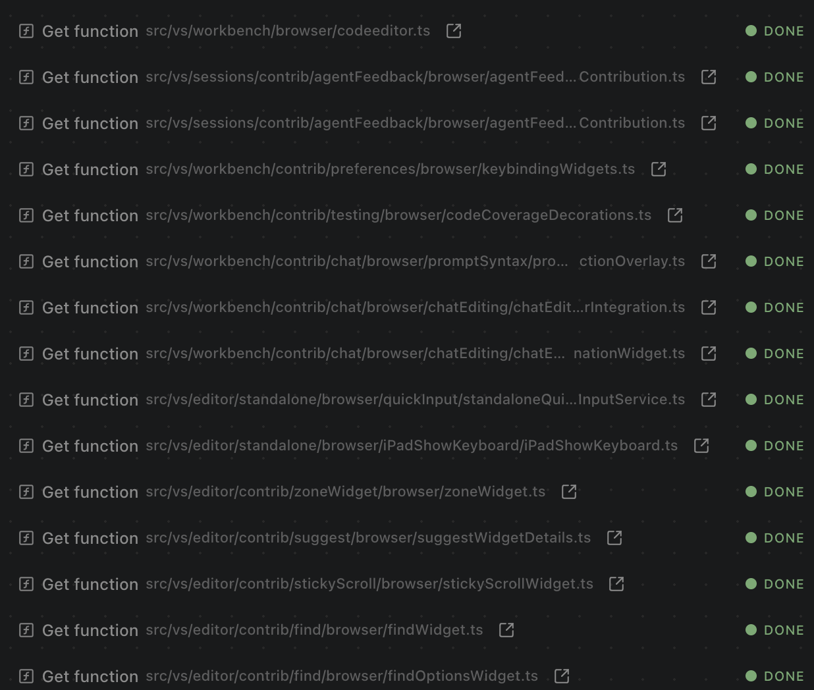

# Minimal Roundtrips

**Dirac can process multiple files or run multiple safe commands in parallel, minimizing roundtrip and API costs.**

Standard agents are often "single-threaded." Dirac breaks this bottleneck by batching operations. Need to see the interface, implementation, and tests? Dirac reads them all at once. Need to install, build, and test? Dirac executes the sequence in one go.

